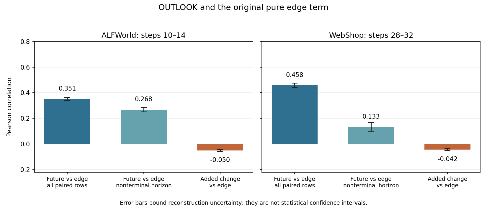

# OUTLOOK advantage versus the original edge term

Analysis saved 2026-09-18T00:26:25.300699+00:00. Both training jobs continued running during this CPU-only analysis.

The future advantage overlaps moderately with the original edge signal. Its incremental change to historical credit is nearly uncorrelated with that edge signal. Similarity falls substantially when terminal-adjacent rows are excluded.

All comparisons use the same current OUTLOOK rollout occurrences. The comparator is the original **pure one-step edge formula**, reconstructed with chronological order and duplicate padding removed. It is not the full G2PO advantage and does not use different-policy historical batches.

$$
E_t=\operatorname{Standardize}_{q}[V_{\mathrm{node}}(o_{t+1})-V_{\mathrm{node}}(o_t)],
\qquad F_t=A_t^{\mathrm{out}},\qquad
\Delta_t=0.25(F_t-A_t^{\mathrm{hist}}).
$$

The future and incremental advantages are measured before the trainer's final task normalization. These are credit similarities, not measured gradient similarities.

| Benchmark | Steps | Recoverable edge rows / all rows | Pearson: future vs edge | Pearson: incremental change vs edge |
|---|---|---:|---:|---:|
| ALFWorld | 10–14 | 29,651 / 29,767 (99.6%) | 0.351 [0.339, 0.364] | -0.050 [-0.056, -0.045] |
| WebShop | 28–32 | 5,085 / 5,242 (97.0%) | 0.458 [0.441, 0.475] | -0.042 [-0.051, -0.034] |

The bracketed ranges are conservative **reconstruction bounds**, not statistical confidence intervals. Missing original edge identities exclude 0.4% of ALFWorld rows and 3.0% of WebShop rows; the bounds do not make claims about those excluded rows.

| Benchmark | Future vs edge, excluding terminal-adjacent rows | Same-sign fraction on identifiable nonzero signs |
|---|---:|---:|
| ALFWorld | 0.268 [0.250, 0.287] | 61.7% (6,239 / 10,116) |
| WebShop | 0.133 [0.100, 0.168] | 64.8% (2,120 / 3,271) |

Terminal-adjacent means the two-step horizon reaches the recorded trajectory end; these rows have zero bootstrap and future credit equals historical credit. Excluding them removes a large part of WebShop's observed overlap. Sign agreement excludes zero edge values and rows whose future-sign interval crosses zero.

**Per-step results.**

| Benchmark | Step | Edge coverage | Future vs edge Pearson | Increment vs edge Pearson |
|---|---:|---:|---:|---:|
| ALFWorld | 10 | 99.1% | 0.387 [0.376, 0.399] | -0.048 [-0.053, -0.044] |
| ALFWorld | 11 | 99.5% | 0.348 [0.338, 0.358] | -0.046 [-0.051, -0.041] |
| ALFWorld | 12 | 99.6% | 0.360 [0.341, 0.378] | -0.053 [-0.062, -0.044] |
| ALFWorld | 13 | 99.8% | 0.400 [0.388, 0.412] | -0.025 [-0.031, -0.020] |
| ALFWorld | 14 | 100.0% | 0.221 [0.221, 0.221] | -0.106 [-0.106, -0.106] |
| WebShop | 28 | 99.2% | 0.458 [0.442, 0.474] | -0.054 [-0.063, -0.046] |
| WebShop | 29 | 100.0% | 0.439 [0.421, 0.458] | -0.030 [-0.040, -0.020] |
| WebShop | 30 | 86.2% | 0.472 [0.456, 0.489] | -0.016 [-0.025, -0.008] |
| WebShop | 31 | 99.7% | 0.431 [0.415, 0.448] | -0.081 [-0.090, -0.072] |
| WebShop | 32 | 99.7% | 0.513 [0.496, 0.530] | -0.013 [-0.021, -0.005] |

**Reconstruction and validation.**

- Froze the last five fully logged steps of each run into local snapshots. CSV row counts match `outlook_unique_rows`; all sampled steps have live fraction 1 and no unsupported future endpoint fallback.
- The main CSV contains historical credit and its baselines. The length sidecar preserves canonical task/trajectory/turn order. Rows were joined within trajectory using the six-decimal historical credit and the binary terminal-return schedule. A quantity was accepted only when all candidate matches agreed; ambiguous identities were retained as intervals or excluded.
- Binary rewards (0/10), gamma 0.95, trajectory lengths and the local 0.1 penalty recover raw return targets. Penalized-return discrepancies from the discrete return grid are below 1.5e-6.
- The future raw-value readout is reconstructible when raw return is an affine function of the penalized target over its reference pool. Otherwise its possible value is bounded using the minimum and maximum target adjustment, the same credibility/task-prior blend, and explicit bounds on denominator-floor effects. This avoids guessing the missing context weights.
- Original observation node values were recovered from exact node buckets, or from singleton/failure-only fallback nodes. Per-task edge normalization used complete task gains, or the identity that a singleton node's full G2PO advantage equals its edge component. Unresolved edge values were excluded.
- A CPU fixture check compared recovered arrays directly against the actual outlook and edge implementations for all-valid and mixed-validity trajectories. Identifiable future values and edge values agree within 1e-5; all actual future values lie within the reconstructed intervals.
- ALFWorld step 14 is fully reconstructible. Its recovered mean absolute future advantage differs from the logged value by less than 1e-7; its mixture-change magnitude and history/future correlation also match. For all ten batches, logged full-batch future magnitudes lie inside the reconstructed aggregate bounds.
- As a cross-check, affine-identifiable samples alone give future/edge correlations of 0.354 on ALFWorld (96.5% coverage) and 0.564 on WebShop (60.5% coverage). The latter overrepresents terminal/identifiable cases, so the broader bounded estimate 0.458 is used in the headline.

**Interpretation.** The future component shares some value-gain structure with the edge term, but their sample-level signals differ substantially. The implemented OUTLOOK change to the historical estimator is not closely aligned with adding the original edge term. This is evidence about these sampled batches and does not establish that either signal is better for learning.

Reproducibility: [analysis code](../.local/reports/outlook-edge-20260918/analyze.py), [numerical verification](../.local/reports/outlook-edge-20260918/verify.py), [full results](../.local/reports/outlook-edge-20260918/results.json). Immutable input snapshots and paired arrays are in the same local report directory.

**Native-scale magnitudes.**

| Benchmark | Mean absolute future advantage | Mean absolute standardized edge | Future / edge magnitude |
|---|---:|---:|---:|
| ALFWorld | 0.195 [0.194, 0.196] | 0.162 | 1.20x [1.20, 1.21] |
| WebShop | 0.909 [0.896, 0.922] | 0.331 | 2.74x [2.70, 2.78] |

These compare the raw future component with the original task-standardized edge in their implemented units. OUTLOOK then multiplies the future component by 0.25; the original edge coefficient was 1.0. ALFWorld subsequently standardizes the combined advantage. Magnitude ratios do not represent fractions of the policy gradient.

**Removing 0.25 and normalizing future credit.**

For any positive constant c, Pearson correlation satisfies Corr(cF, E) = Corr(F, E). Global z-scoring also leaves it unchanged. The original future-versus-edge correlations above already used unweighted future credit. Removing 0.25 increases its magnitude fourfold, without changing its correlation or sign. Likewise Corr(0.25(F-H), E) = Corr(F-H, E). These identities concern scaling a component, not changing the composition of the combined advantage.

As a separate offline comparison, standardize the future component within each task and training step: Z_q(F) = (F - mean_q(F)) / (sample_std_q(F) + 1e-6). The task statistics include all canonical occurrences before filtering unrecoverable edge rows. The original edge comparator is already standardized per task. This separate component normalization is not the live trainer's final normalization of the combined advantage.

| Benchmark | Steps | Raw F vs edge | Global z-score(F) vs edge | Per-task z-score(F) vs edge | Per-task z-score(F), excluding terminal-adjacent rows | Per-task z-score(F-H) vs edge |
|---|---|---:|---:|---:|---:|---:|
| ALFWorld | 10–14 | 0.351 | 0.351 | 0.261 | 0.152 | -0.056 |
| WebShop | 28–32 | 0.458 | 0.458 | 0.381 | 0.077 | -0.052 |

The normalized numbers are approximate midpoint reconstructions on the same frozen samples, not exact logged future arrays. The reconstruction bounds reported for raw future credit do not automatically apply after per-task normalization. Per-task normalization preserves each nondegenerate task's own Pearson correlation, but changes the pooled result by changing relative task scales and removing task means. The pooled normalized future component is less correlated with the edge comparator in these samples; the normalized increment remains near zero correlation.

Reproducibility: [normalization analysis](../.local/reports/outlook-edge-20260918/normalize.py), [normalization results](../.local/reports/outlook-edge-20260918/normalization-results.json). Raw, positively scaled, and globally standardized correlations were checked to agree within 1e-12. This analysis did not change the running experiments.
