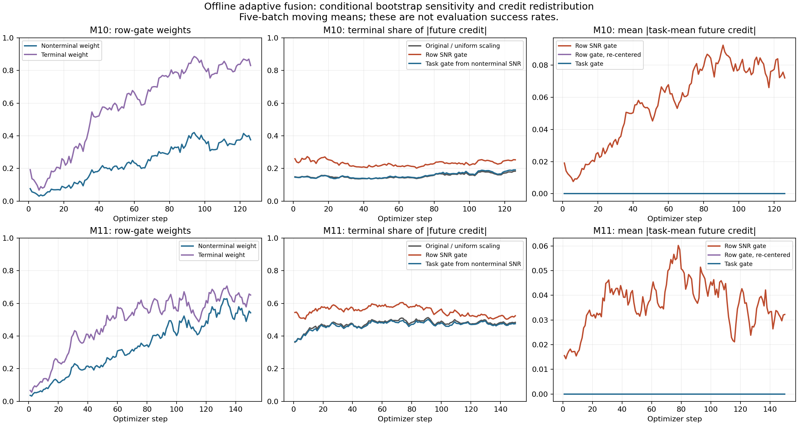

# Offline check of adaptive future-progress fusion

The proposed SNR gate identifies **conditional instability of the raw progress estimate**, but this audit does not establish that it improves training. On late WebShop batches it retains 81.7% of the original absolute future credit, increases the terminal share from 48.2% to 52.4%, and removes the original task-wise zero mean. A task-wide weight preserves that zero mean and is a cleaner structural control. Neither weight measures the future term's incremental usefulness to the policy.

These are counterfactual calculations on saved rollout batches. No training configuration, live process, checkpoint, optimizer, or GPU allocation was changed. No new policy evaluation was run.

## Data and reconstruction

The manifest was frozen at **2026-09-19 01:35:34 UTC**. It covers the available completed snapshots at that time, not subsequent training steps.

| Run | Saved optimizer steps | Batches | Canonical turn rows | Trajectories |
|---|---:|---:|---:|---:|
| M10, ALFWorld, Qwen2.5-1.5B | 1–126 | 126 | 469,668 | 16,128 |
| M11, WebShop, Qwen2.5-1.5B | 1–150 | 150 | 138,291 | 19,200 |
| Total | | 276 | 607,959 | 35,328 |

Both runs have 16 tasks per batch, eight trajectories per task, a one-step future horizon, and future weight 1. All audited rows are eligible and live. The saved rows have already had trainer-padding duplicates removed. Counts refer to rollout occurrences, not distinct tasks across training.

The audit reconstructs the contextual potential from saved processed features, observation groups, trajectory IDs, and return labels. It preserves the original float32 label cast, float64 aggregation, distance/bandwidth calculation, denominator floors, whole-query-trajectory exclusion, support shrinkage, and task fallback. The maximum difference from the saved current value/kernel/support/lambda across all 276 snapshots is **7.11e-15**. Endpoint lookup, terminal values, raw progress, and task standardization also reproduce the saved scalars. WebShop's applied float32 actor scalar agrees with the reconstructed combined credit within **9.51e-7**.

Sources: [frozen manifest](plan.json), [M10 method](../m10-ccpo-attncred-ctxadv-future-progress-alfworld-1.5b-2gpu-20260918/NOTES.md), [M11 method](../m11-ccpo-attncred-ctxadv-future-progress-webshop-1.5b-2gpu-20260918/NOTES.md).

## What the gate estimates

Write the existing historical credit as \(H_{i,t}\). The potential uses unpenalized labels \(Z_{j,u}=0.95^{T_j-u}R_j\), with binary episode outcome \(R_j\in\{0,10\}\). For a supported exact-observation group,

\[
\widehat V_{i,s}=\lambda_{i,s}K_{i,s}[Z]
 +(1-\lambda_{i,s})\overline Z^{\mathrm{task}}_{-i},
\qquad \lambda_{i,s}=\frac{J_{i,s}}{J_{i,s}+2}.
\]

Here \(K\) is the context-weighted peer-visit average, and \(J\) counts other trajectories supporting that observation. Both the kernel and task prior exclude the entire query trajectory. If the exact group has no peer support, the implementation uses the context-weighted whole-task fallback. At the terminal endpoint, \(\widehat V_{i,T_i}=R_i\).

The existing future term and fusion are

\[
P_{i,t}=\widehat V_{i,t+1}-\widehat V_{i,t},\qquad
F_{i,t}=\frac{P_{i,t}-\mu_q(P)}{s_q(P)+10^{-6}},\qquad
A^{\mathrm{pre}}_{i,t}=H_{i,t}+F_{i,t},
\]

where \(s_q\) is the sample standard deviation over the task's supported turn rows. There is no extra outer discount in the difference. WebShop applies this combined scalar directly; ALFWorld applies its existing final combined normalization afterward.

For each query trajectory, sample its **seven other peer trajectories with replacement**, retaining all visits from each sampled trajectory as one block. Use the same sampled counts for the current endpoint and future endpoint, and for all turns of that query trajectory. In particular,

\[
v_{i,t}=\widehat{\operatorname{Var}}_b
 \left(\widehat V^{(b)}_{i,t+1}-\widehat V^{(b)}_{i,t}\right)
\]

includes covariance between the two estimates; it is not the sum of their separate variances. Terminal outcome \(R_i\) stays fixed, but uncertainty in the current potential still contributes to terminal progress variance.

Bootstrap counts affect the kernel, visit-weighted task prior, and support \(J\). A repeated trajectory is treated as a distinct empirical sample draw for bootstrap support, not as new factual evidence in the original batch. This convention is part of the diagnostic. Features, original bandwidths, reward labels, and original task-normalization statistics stay fixed. If resampling removes all exact-observation peers, the bootstrap readout takes the same task fallback as the estimator.

Use 256 draws to estimate the gate and a separate 256 draws to measure conditional sensitivity:

\[
w_{i,t}=\frac{[P_{i,t}^{2}-v_{i,t}]_+}{P_{i,t}^{2}+10^{-12}},
\qquad A^{\mathrm{row}}_{i,t}=H_{i,t}+w_{i,t}F_{i,t}.
\]

The gate is calculated from **raw** progress, then applied **after** future standardization. It is bounded in \([0,1]\). Its explicit zero-signal convention is \(w=0\) when \(P=v=0\). It is a positive-part SNR heuristic, not a calibrated probability of correctness. Any training implementation would detach the constructed coefficient and advantage; this audit has no autograd graph.

## Compared variants

| Label in artifacts | Added future component | Purpose |
|---|---|---|
| `fixed_0` | \(0\) | History-only counterfactual on the same saved rows |
| `fixed_025` | \(0.25F\) | Fixed smaller-weight control |
| `fixed_1` | \(F\) | Original M10/M11 scalar |
| `row_snr` | \(w_{i,t}F_{i,t}\) | Proposed step-wise gate |
| `row_snr_centered` | \(wF-\mu_q(wF)\) | Diagnose the effect of restoring task zero mean |
| `matched_task_scale` | \(a_qF\) | Match the row gate's absolute future mass within each task |
| `task_nonterminal_snr` | \(w_qF\) | Use a shared task weight inferred from nonterminal progress |

The two task-wide coefficients are

\[
a_q=\frac{\sum_{(i,t)\in q}|w_{i,t}F_{i,t}|}
 {\sum_{(i,t)\in q}|F_{i,t}|},
\qquad
w_q=\frac{[\operatorname{mean}_{\mathrm{NT}(q)}P^2-
                    \operatorname{mean}_{\mathrm{NT}(q)}v]_+}
 {\operatorname{mean}_{\mathrm{NT}(q)}P^2+10^{-12}}.
\]

Zero-mass tasks get \(a_q=0\); tasks without nonterminal rows get \(w_q=0\). Both task coefficients are applied to all that task's rows, including terminal rows. The shared weight preserves \(\mu_q(w_qF)=0\); it does not re-standardize the weighted term and cancel its scale. The matched control isolates selective suppression from merely reducing the total magnitude. It is constructed from the row gate and is not an independent proposed estimator.

## WebShop results

The following table uses M11 **steps 100–150**, 51 batches, 35,391 turn rows. Percentages are equal-weight means of per-batch statistics. They are **credit diagnostics, not success rates**.

| Future component | Mean weight | Original absolute future mass retained | Terminal share of absolute future mass | Mean absolute task-mean future credit | Frozen-scale noise proxy, relative to original |
|---|---:|---:|---:|---:|---:|
| Original, \(F\) | 1.000 | 100.0% | 48.2% | ≈0 | 1.000 |
| Fixed, \(0.25F\) | 0.250 | 25.0% | 48.2% | ≈0 | 0.0625 |
| Step-wise SNR, \(wF\) | 0.538 | 81.7% | 52.4% | 0.0347 | 0.469 |
| Matched task-wide scale, \(a_qF\) | 0.606 | 81.7% | 48.0% | ≈0 | 0.531 |
| Step-wise SNR, then re-center | — | 85.1% | 49.9% | ≈0 | Not computed |
| Task-wide nonterminal SNR, \(w_qF\) | 0.596 | 82.3% | 47.4% | ≈0 | 0.564 |

The row gate's average coefficient is only 0.538, but it retains 81.7% of the magnitude because large-credit rows tend to retain larger weights. Average weight alone therefore overstates how much the future channel is being suppressed. Nonterminal absolute future mass retention is 75.0%; mean weights are 0.520 on nonterminal rows and 0.619 on terminal rows.

For frozen original task scales, define the independent-draw noise proxy

\[
N(w)=\frac{\sum_{i,t}w_{i,t}^{2}\,v^{\mathrm{test}}_{i,t}/(s_q(P)+10^{-6})^2}
 {\sum_{i,t}v^{\mathrm{test}}_{i,t}/(s_q(P)+10^{-6})^2}.
\]

It is the sum of conditional scalar variances under fixed weights and normalization statistics. It is **not** the variance of the PPO gradient, uncertainty in the full normalized estimator, or a measure of expected return. In particular, weight 0.25 mechanically gives \(N=0.25^2\).

The row gate's mean proxy is **11.6% lower** than the equal-absolute-mass task-scale control: \(1-0.46933/0.53084\). Thus it does select conditionally less noisy credit, beyond its reduction of amplitude. The proxy for the re-centered variant is not computed because it needs cross-row covariance that this per-query conditional audit does not estimate.

The row gate also preferentially retains terminal credit and introduces a positive task offset. That is an additional change to credit assignment, not simply a quieter version of the original future term. Restoring the task mean removes that offset but changes individual credits again. A shared task weight preserves the within-task terminal/nonterminal mix; aggregate terminal share can still move because different tasks receive different weights.

## Conditional direction stability

For nonterminal rows with nonzero original raw progress, measure how often the independent bootstrap draws preserve its sign. These test draws use the same empirical peer pool; they are not held-out trajectories or new environment outcomes.

| Run/window | Low-weight rows, \(w<0.2\) | Sign agreement | High-weight rows, \(w>0.8\) | Sign agreement |
|---|---:|---:|---:|---:|
| M10, steps 1–126 | 152,132 | 66.37% | 45,560 | 98.48% |
| M11, steps 1–150 | 22,076 | 63.47% | 22,934 | 98.68% |
| M11, steps 100–150 | 3,104 | 68.59% | 12,625 | 99.59% |

This supports the narrow interpretation that the gate distinguishes raw-progress direction stability under the chosen resampling scheme. Stability is not evidence that the future signal adds useful policy-gradient information beyond history.

## The zero-progress/negative-credit case

Across M11 steps 1–150 there are **1,932 nonterminal rows on the only successful trajectory in a task batch**. For all 1,932:

- Excluding the successful query trajectory leaves only failed peers, so both nonterminal potentials are zero.
- Raw progress is exactly zero and its conditional bootstrap variance is zero.
- Task centering makes the normalized future term negative, because the task also has positive terminal progress.
- The original combined historical-plus-future scalar is not negative on any of these rows.

The row gate sets all these future terms to zero through its \(P=v=0\Rightarrow w=0\) convention. This does **not** demonstrate that it detected noisy or wrong predictions: the raw zero estimate is perfectly stable within the observed peer pool. It exposes the mismatch between gating raw progress and applying that gate to centered progress.

| M11, all 150 batches | Negative future rows among those 1,932 | Negative combined rows |
|---|---:|---:|
| Original \(F\) | 1,932 | 0 |
| Step-wise gate \(wF\) | 0 | 0 |
| Step-wise gate, then re-center | 1,932 | 0 |
| Matched task-wide scale | 1,932 | 0 |
| Task-wide nonterminal SNR | 1,827 | 0 |

M10 has the analogous pattern on 3,237 rows; its combined counts here refer to the canonical **pre-final-normalization** scalar. These counts must not be described as removing a proven harmful policy gradient. Successful trajectories may also contain actions that deserve negative relative credit.

## Does the gate specifically turn down WebShop?

No. On the same optimizer-step window, **100–120**, the proposed row gate retains more of WebShop's future term than ALFWorld's:

| Step-wise gate, matched window | Mean weight | Absolute future mass retained | Original terminal share | Gated terminal share |
|---|---:|---:|---:|---:|
| M10, ALFWorld | 0.380 | 64.1% | 17.1% | 24.2% |
| M11, WebShop | 0.486 | 79.0% | 48.1% | 53.2% |

It adapts to conditional raw-progress SNR, not to which benchmark benefits from the future channel. This audit gives no justification for interpreting a high coefficient as evidence of higher validation benefit.

## Validation and Monte Carlo sensitivity

The full audit uses 256 gate-estimation draws plus 256 independent test draws per query trajectory. A sensitivity run uses 1,024 + 1,024 draws on steps 10, 30, 60, 100, 120, and 150 where available: 11 batches and 24,726 rows across both benchmarks. The runs use the same seed prefix, so this checks draw-count sensitivity, not independent empirical datasets.

- Pooled mean absolute difference in row weights: **0.00758**; 95th percentile: **0.04414**.
- Largest difference in a batch's mean weight: **0.00162**, or 0.162 percentage points.
- Largest difference in a batch's retained absolute future mass: **0.276 percentage points**.
- Largest difference in a batch's terminal share: **0.142 percentage points**.

Aggregate conclusions are stable to this increase in draw count; some individual gates near a threshold are more sensitive. Five unit checks pass, including a hand-calculated readout, whole-query-trajectory exclusion, fallback behavior, gate bounds/zero handling, and exact cancellation of perfectly correlated endpoint noise. All 276 source files retain their manifest size/mtime, and both config hashes still match.

Machine-readable evidence: [validation](VALIDATION.json), [sensitivity](sensitivity-summary.json), [complete summary](audit/summary.json), [comparison CSV](comparison.csv). The validation artifact includes source and analysis code hashes.

## Interpretation and next experiment design

The raw step-wise gate is **not yet justified as the next default fusion rule**. It reduces conditional estimator noise, but it also changes task centering and shifts credit toward terminal steps. Its apparent removal of negative credit on the sole successful trajectory is a zero-signal convention, and the original combined credit was already nonnegative there.

If testing adaptive confidence fusion, the task-wide nonterminal SNR coefficient is a cleaner structural ablation because it preserves the task mean and relative credit pattern. It remains a confidence heuristic and retains roughly 82% of late WebShop future mass. It is not a demonstrated solution to a weak or redundant future channel. The fixed 0.25 control is still informative. Any subsequent training comparison should keep history, initialization, data, scorer, optimization, and training budget matched, include fixed weights 0/0.25/1, and avoid choosing the weight from validation outcomes. No such runs were launched by this audit.

Limits of this result:

- Seven empirical peers cannot reveal unseen success modes. All-failed peer pools can have zero bootstrap variance while remaining poor estimates of the environment's return distribution.
- Bootstrap geometry, reward labels, normalization statistics, and terminal outcomes are fixed. This does not quantify uncertainty in representations, reward scoring, or the full normalized future estimator.
- The saved WebShop labels are the labels used by those runs. This analysis does not correct item-option scoring or produce corrected validation success rates.
- No policy gradients, PPO clipping effects, gradient alignment, or post-update performance are measured. Advantage sign changes alone are not gradient conflicts.
- ALFWorld's padding-dependent final combined normalization is not reconstructed for counterfactual variants. Cross-benchmark comparisons above concern canonical future credit, not equal actor-gradient amplitudes.
- These are on-policy trajectories from the original weight-1 runs. Changing the weight during training changes subsequent trajectories, which cannot be inferred from this replay.

## Artifacts and reproduction



[Exportable PDF](adaptive_fusion.pdf). Figure curves are five-batch moving means; tables use unsmoothed per-batch statistics. Ratios are averaged equally across batches; count fields are totals; direction-stability groups are pooled by row count.

From `/workspace/agent-context-grpo`, using the existing project environment:

```bash
OMP_NUM_THREADS=1 OPENBLAS_NUM_THREADS=1 MKL_NUM_THREADS=1 CUDA_VISIBLE_DEVICES='' \
  .venv/bin/python scripts/analyse_adaptive_progress.py \
  --plan experiments/adaptive-fusion-offline-20260919/plan.json \
  --output experiments/adaptive-fusion-offline-20260919/audit

OMP_NUM_THREADS=1 OPENBLAS_NUM_THREADS=1 MKL_NUM_THREADS=1 CUDA_VISIBLE_DEVICES='' \
  .venv/bin/python scripts/analyse_adaptive_progress.py \
  --plan experiments/adaptive-fusion-offline-20260919/plan.json \
  --output experiments/adaptive-fusion-offline-20260919/sensitivity-b1024 \
  --steps 10,30,60,100,120,150 --bootstrap 1024

.venv/bin/python experiments/adaptive-fusion-offline-20260919/validate.py
.venv/bin/python experiments/adaptive-fusion-offline-20260919/render.py
```

Existing audit records are reused by default; add `--no-resume` to recompute them. The script reads saved arrays with `allow_pickle=False`, uses NumPy with one numerical thread and lower process priority, and imports no model, environment, torch, or GPU runtime. Row-level diagnostics are under `audit/row_diagnostics/`; per-step statistics are under `audit/per_step/`. Implementation: [analysis script](../../scripts/analyse_adaptive_progress.py), [unit checks](../../tests/test_adaptive_progress_analysis.py), [artifact validator](validate.py), [figure renderer](render.py).
